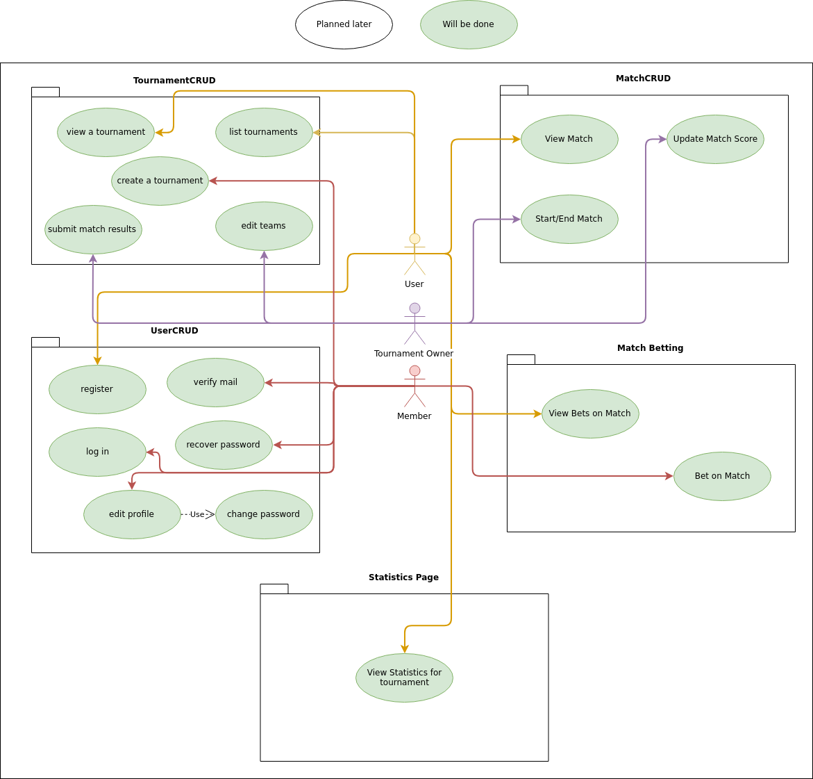

# turnie.re - Software Requirements Specification  

## Table of contents

%toc-content%
    
# %toc-caption-1% Introduction
## %toc-caption-2% Purpose
This System Requirements Specifications will specify the requirements towards the turnie.re project.  
It consists of a backend, a web frontend and possibly an Android app.
The document will specify all planned features and use cases.

## %toc-caption-2% Scope
In the scope of this SRS are all components related to turnie.re: The backend, the web frontend and potentially the Android app.

## %toc-caption-2% Definitions, Acronyms and Abbreviations
All the (technical) terms, acronyms and abbreviations used in this document are listed and described in the table below.

| Abbreviation / Term | Definition |
| --- | --- |
| User | Any human-like creature interacting with a component |
| Member | A user with an account |
| Tournament Owner | The owner of a tournament with access to all of it's features |

## %toc-caption-2% References
All the important references, that are part of this project are listed below.

| Title | Link | Date (added) |
| --- | --- | --- |
| RUP SRS Specification | http://sce.uhcl.edu/helm/RationalUnifiedProcess/webtmpl/templates/req/rup_srs.htm | 21. Oct. 2018 |
| Blog | [blog.turnie.re](blog.turnie.re) | 19. Oct. 2018 |
| GitHub Organization | [git.turnie.re](git.turnie.re) | 19. Oct. 2018 |
| Issues | [jira.turnie.re](jira.turnie.re) | 21. Oct. 2018 |

## %toc-caption-2% Overview
This document will follow the structure defined in the RUP SRS Specification:
It will start with a general description of the complete product and it's components including the use case diagram.
The following section includes a detailed description of all requirements divided into multiple subsections.

# %toc-caption-1% Overall descriptions
Planning a tournament is a big effort without a digital tool on hand.
You have to remember teams, their results and based on that data determine winners which are transferred into the next stage.  
It will get even more complicated if you want to manage a group phase and transfer teams into playoffs based on their results in that phase.

Some people tend to use magically (not-)working solutions based on Excel sheets which are not scalable or even maintainable.  
To solve this once and for all we want to create a web page which will take care of managing your tournaments so you can focus on more important parts of your events.

## %toc-caption-2% Use Case Diagram

# %toc-caption-1% Specific Requirements
## %toc-caption-2% Functionality
This section will contain all functional requirements for our application.
It will ignore the separation of backend, frontend and app and just focus on general functions.

### %toc-caption-3% Authorization
A *user* is able to read the manual, create an account (register), log in, recover their password, list public tournaments and view a public tournament.
After registration and login a *user* will become a *member* with access to all available features.

The use case specification for the register use-case can be found [here](use-cases/UCS-Register.md).

### %toc-caption-3% User management
Each *member* has a unique username and email-address and a password.
It can use either the username or the mail-address and the password to log in.
While logged in it can change their username, email-address and password.

The use case specification for the recover password use-case can be found [here](use-cases/UCS-RecoverPassword.md).

### %toc-caption-3% Tournament management
A *member* can create a tournament and become it's *tournament owner*.
A *tournament* consists of a name, an optional description and multiple teams.
Each *team* has a unique name, which can be changed later on, and optionally a picture assigned to it.
On creation a member can specify those attributes
and create a group phase by specifying the number of teams per group and how many teams should get into the playoff stage.
The tournament view can be customized with a background, banner and color scheme.
There are two views to show a tournament:
A normal view designed for use by the tournament owner to enter match results
and a view designed for display on a big screen like a beamer displaying only one stage at a time.

If a group phase was chosen, it is initialized first after tournament creation.
It will consist of random groups including all given teams and a number of messages.
After all group matches are finished or if group phase was skipped a playoff phase will be generated.
It will consist of multiple stages depending on the number of teams chosen to get into this phase.
The winning teams of each stage will get into the next one resulting in a final stage with two teams and a tournament winner.

After a tournament is finished, leaderboards with relevant tournament statistics are generated and displayed.
## %toc-caption-2% Usability
The usability requirement is described separately by component.

### %toc-caption-3% Backend (REST API)
The backend will be used by the other two components and is not supposed to be used by the general user.
It will be documented publicly and will provide users with a technical understanding the option to create their own client applications.

### %toc-caption-3% Web Frontend
The web frontend is the most important component and everyone should be able to use it.
There will be an extensive manual explaining how to use and access every function of the project.

### %toc-caption-3% Android App
The Android app is the second most important component and everyone should be able to use it as well.
It will adhere to Google's Material Design Guidelines regarding usability.

## %toc-caption-2% Reliability
The backend as the most important should be available 99% of the time (downtime at most ~15m daily, ~7h monthly, 3d 16h yearly).
There will be proper monitoring and deployment techniques in place to ensure this requirement.
The web frontend depends on the backend therefore the same uptime guarantee can be given here.
As for the Android App which will feature an offline mode to allow it to function even during downtimes of the backend.

To ensure no features are deployed to production without proper testing
there will be automated unit- and integration-testing in place which is run for every change.

## %toc-caption-2% Performance
### %toc-caption-3% Response time
The response time of the backend should never exceed one second for user management and authorization tasks.
Tournament management is, especially during tournament creation, highly dependent on the database and very resource intensive and will exceed this limit but should never exceed a response time of 30 seconds for each task.
To handle large amounts of concurrent users with a reasonable response time the backend and database should be scalable.

### %toc-caption-3% Capacity
As most of the stored data is just text there is no real upper limit for user accounts or tournaments.

## %toc-caption-2% Supportability
### %toc-caption-3% Coding Style
To keep the Java code maintainable it should adhere to [Google's Java Style Guide](https://google.github.io/styleguide/javaguide.html).
The JavaScript frontend code should adhere to [Google's JavaScript Style Guide](https://google.github.io/styleguide/jsguide.html).
Both styleguides will be checked and enforced on every change.

## %toc-caption-2% Design Constraints
The project will use the MVC architecture.  
The backend is written in Java using Spring and will provide a REST API.  
This API is accessed by the web frontend which is written in JavaScript using React.
As Java is the only officially supported language on Android, the app is also written in Java.

## %toc-caption-2% Online User Dosumentation and Help System Requirements
All pages and forms should be designed as intuitive as possible.
Additionally there will be a FAQ and instruction page to guide users through the process of creating and managing tournaments.

To document the API there will be an extensive document describing all available methods and parameters.
## %toc-caption-2% Purchased Components
At the moment all components are hosted on a private server. 
In the future their might be costs associated with purchasing more and bigger servers.

## %toc-caption-2% Interfaces
### %toc-caption-3% User Interfaces
All user interfaces should be available on the web frontend an the Android app.
* **Index page** featuring basic information about the project and instructions
* **Register form** showing input fields to create a user account
* **Login form** showing input fields to enter a username/email-address and the corresponding password
* **Edit profile** showing input fields to edit user details such as username, email-address and password
* **Tournament creation form** showing input fields to create tournament
* **Tournament view** showing the group/playoff phase of a tournament
* **Tournament beamer view** showing a single stage of a tournament
* **Edit tournament** showing input fields to change tournament attributes
* **Match result submit form** showing input fields to enter match results; popup on the tournament view on the web frontend

### %toc-caption-3% Hardware Interfaces
n/a

### %toc-caption-3% Software Interfaces
n/a

### %toc-caption-3% Communications Interfaces
The backend and web frontend will be served via *HTTPS* on port 443.
Clients connecting via *HTTP* on port 80 will be redirected to *HTTPS*.

## %toc-caption-2% Licensing Requirements
tbd

## %toc-caption-2% Legal, Copyright and Other Notices
tbd

## %toc-caption-2% Applicable Standards
* [Google's Java Style Guide](https://google.github.io/styleguide/javaguide.html)
* [Google's JavaScript Style Guide](https://google.github.io/styleguide/jsguide.html)
