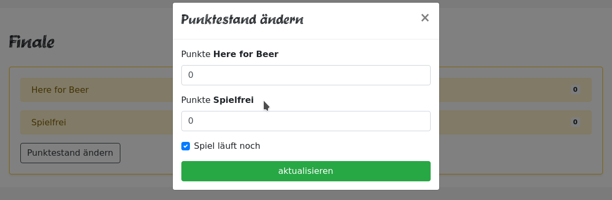

# turnie.re

Use Case Specification: MatchCRUD;  
Version v1.0

# Table of contents

%toc-content%

# %toc-caption-1% MatchUpdate

## %toc-caption-2% Brief Description

This Use Case Allows Users to bet on who will win the match. When selecting a Match from the List of Matches, the user is asked who he thinks will win. We will then show the percentage each team is voted for.

# %toc-caption-1% Flow of Events

## %toc-caption-2% Basic Flow

 - owner of tournament clicks on Match within that tournament
 - user is asked for the current score 
 - user submits current score
 - Match is updated according to the options the user submits
 
### %toc-caption-3% Activity Diagram
TBA

### %toc-caption-3% Feature
TBA

### %toc-caption-3% Mockup

#### %toc-caption-4% Match Start
TBA

#### %toc-caption-4% Match Update
TBA

## %toc-caption-2% Alternative Flows
Not Applicable (N/A)

# %toc-caption-1% Special Requirements
Not Applicable (N/A)

# %toc-caption-1% Preconditions
Tournament needs to be created

# %toc-caption-1% Postconditions

## %toc-caption-2% User enters correct score
Match will be updated accordingly

## %toc-caption-2% User enters weird stuff
Error will be shown

# %toc-caption-1% Extension Points
Not Applicable (N/A)
