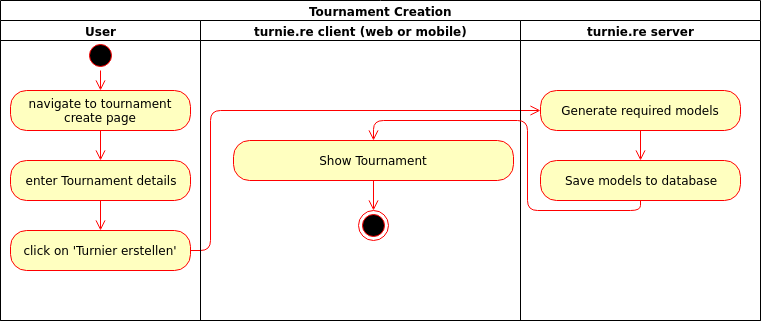
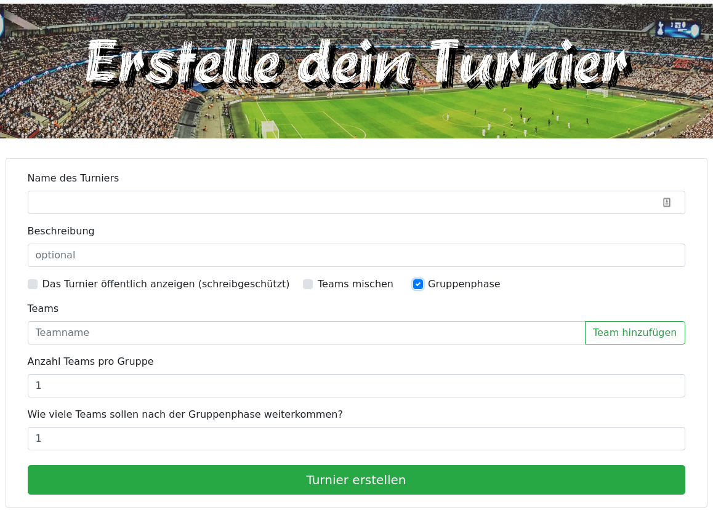

# turnie.re

Use Case Specification: TournamentCRUD  
Version v1.0

# Table of contents

%toc-content%

# %toc-caption-1% Register

## %toc-caption-2% Brief Description

This use case allows users to create update and delete a tournament.

# %toc-caption-1% Flow of Events

## %toc-caption-2% Basic Flow

 - user puts in necessary details for the tournament
 - user clicks on generate button
 - client checks plausibility of settings (format of team names / size of groups)
 - if settings aren't plausible we'll show an error
 - server checks plausibility of settings (format of team names / size of groups)
 - if settings aren't valid we'll show an error
 - show the user the generated tournament
 
### %toc-caption-3% Activity Diagram

### %toc-caption-3% Feature
TBA

### %toc-caption-3% Mockup

## %toc-caption-2% Alternative Flows
Not Applicable (N/A)

# %toc-caption-1% Special Requirements
Not Applicable (N/A)

# %toc-caption-1% Preconditions

## %toc-caption-2% User is not logged in
The user will need to log in / register to create a tournament.

# %toc-caption-1% Postconditions
User has a tournament and can update matches within.

# %toc-caption-1% Extension Points
Not Applicable (N/A)
