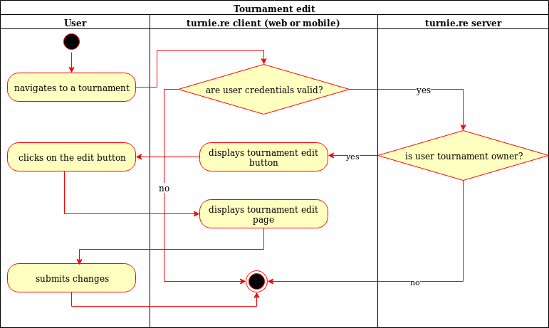

# turnie.re

Use Case Specification: EditTournament;
Version v1.0

# Table of contents

%toc-content%

# %toc-caption-1% Tournament edit

## %toc-caption-2% Brief Description

This use case allows users to edit a tournament.
The user can edit the description, name and team names.

# %toc-caption-1% Flow of Events

## %toc-caption-2% Basic Flow

 - User clicks on tournament page
 - User clicks on edit tournament button
 - User sees form with tournament data
 - User submits edited data
 
###  tktuellen diaoc-caption-3% Activity Diagram

### %toc-caption-3% Feature
TBA

### %toc-caption-3% Mockup

## %toc-caption-2% Alternative Flows
Not Applicable (N/A)

# %toc-caption-1% Special Requirements
Not Applicable (N/A)

# %toc-caption-1% Preconditions
Tournament needs to be created

# %toc-caption-1% Postconditions
Not Applicable (N/A)

# %toc-caption-1% Extension Points
Not Applicable (N/A)
