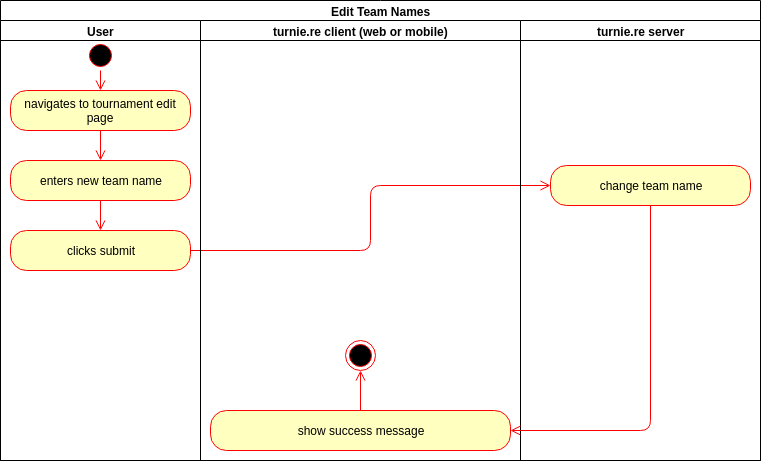
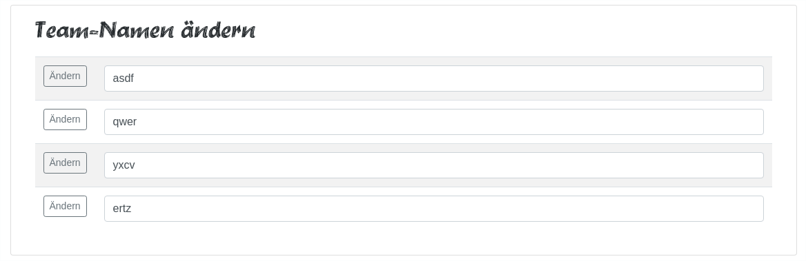

# turnie.re

Use Case Specification: Edit Teams  
Version v1.0

# Table of contents

%toc-content%

# %toc-caption-1% Edit Teams

## %toc-caption-2% Brief Description

This use case allows users to change names of teams.

# %toc-caption-1% Flow of Events

## %toc-caption-2% Basic Flow

 - user creates a tournament
 - user views his tournament (e.g. via the (private) tournament list)
 - if the user is authorized (signed in and owner of the tournament), an edit button is shown
 - user clicks on edit
 - if the user isn't authorized to edit the tournament, he gets an error
 - a list of input fields with the teams is shown, each with an edit button
 - user changes a team name
 - user clicks on the edit button of that team
 - the frontend sends the changed name to the backend
 - if the backend confirms, the user gets a success message
 - if some error occurs, the user gets a error message and the changed name resets
 - as seen by the user, every occurence of the old team name will be replaced with the changed one
 
### %toc-caption-3% Activity Diagram

### %toc-caption-3% Feature
TBA

### %toc-caption-3% Mockup

## %toc-caption-2% Alternative Flows
Not Applicable (N/A)

# %toc-caption-1% Special Requirements
Not Applicable (N/A)

# %toc-caption-1% Preconditions

## %toc-caption-2% User is not logged in
The user will need to log in / register and create a tournament.

# %toc-caption-1% Postconditions
every occurence of the old team name will be replaced with the changed one

# %toc-caption-1% Extension Points
Not Applicable (N/A)
