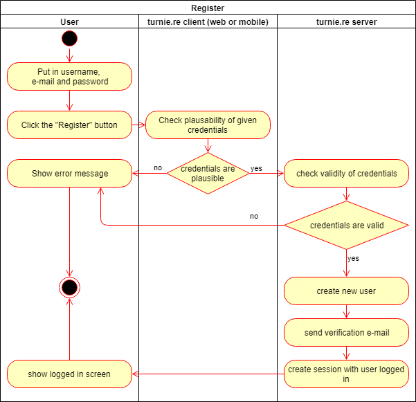

# turnie.re

Use Case Specification: UserCRUD  
Version v1.0

# Table of contents

%toc-content%

# %toc-caption-1% Register

## %toc-caption-2% Brief Description

This use case allows guests to register for our website, and afterwards use our services using the given e-mail, username and password.

# %toc-caption-1% Flow of Events

## %toc-caption-2% Basic Flow

 - user puts in his username, e-mail and password
 - user clicks on "Register" button
 - client checks plausibility of credentials (format of username / e-mail; equality of passwords)
 - if credentials aren't plausible we'll show an error
 - server checks validity of credentials (username doesn't exist; plausibility check)
 - if credentials aren't valid we'll show an error
 - show the user his logged in page
 
### %toc-caption-3% Activity Diagram

### %toc-caption-3% Feature
[features/register.feature](../features/register.feature)

### %toc-caption-3% Mockup

## %toc-caption-2% Alternative Flows
Not Applicable (N/A)

# %toc-caption-1% Special Requirements
Not Applicable (N/A)

# %toc-caption-1% Preconditions

## %toc-caption-2% User is not logged in
The user may not have logged in prior to trying to sign up, since he then has already registered, which should be a one-time only thing to do.

Also the user will need an e-mail and username that has not yet been used to register for our service.

# %toc-caption-1% Postconditions

## %toc-caption-2% User will receive an verification e-mail
The user will receive an verification e-mail to the e-mail he has given.
This e-mail will contain a link, that will set the status of his profile to 'verified'.

## %toc-caption-2% User will be able to perform member-actions
The user will (as long as he is logged in), be able to perform member-actions, like creating tournaments.

# %toc-caption-1% Extension Points
Not Applicable (N/A)
