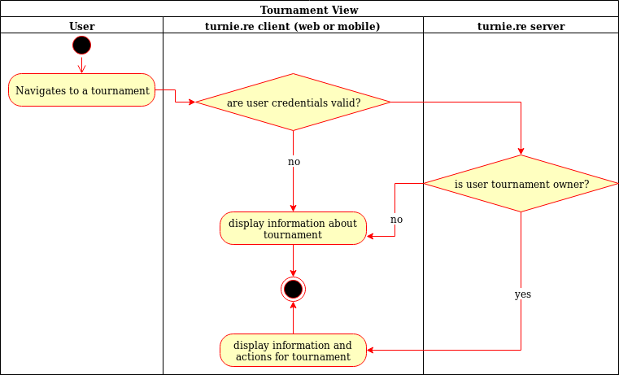
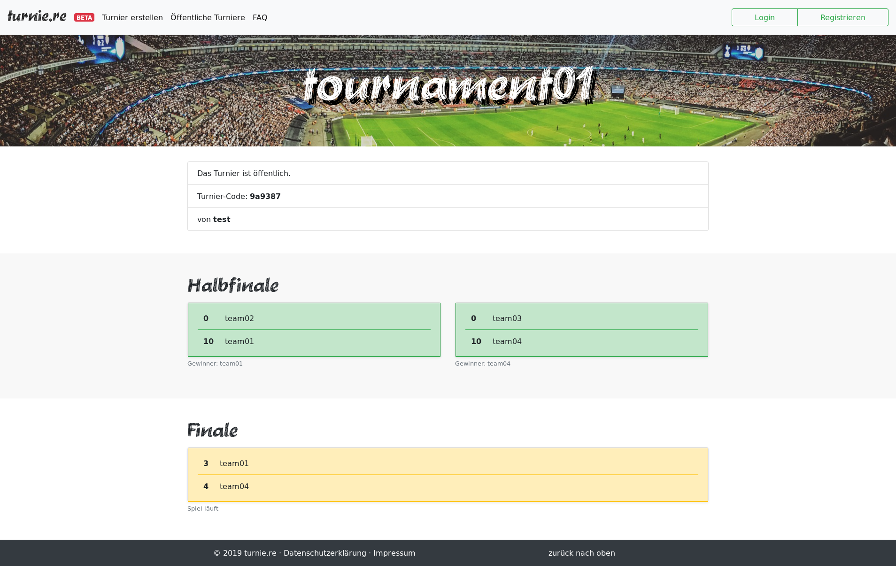

# turnie.re

Use Case Specification: TournamentsPage;
Version v1.0

# Table of contents

%toc-content%

# %toc-caption-1% Tournament

## %toc-caption-2% Brief Description

This use case allows users to see a tournament.
It includes the name, description, owner, group stage and playoff stage of a tournament.

# %toc-caption-1% Flow of Events

## %toc-caption-2% Basic Flow

 - User clicks on tournament page
 - User sees detailed information about a tournament
 
### %toc-caption-3% Activity Diagram

### %toc-caption-3% Feature
TBA

### %toc-caption-3% Mockup

## %toc-caption-2% Alternative Flows
Not Applicable (N/A)

# %toc-caption-1% Special Requirements
Not Applicable (N/A)

# %toc-caption-1% Preconditions
Tournament needs to be created

# %toc-caption-1% Postconditions
Not Applicable (N/A)

# %toc-caption-1% Extension Points
Not Applicable (N/A)
