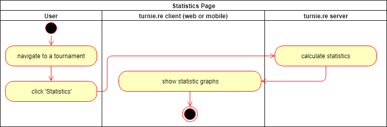
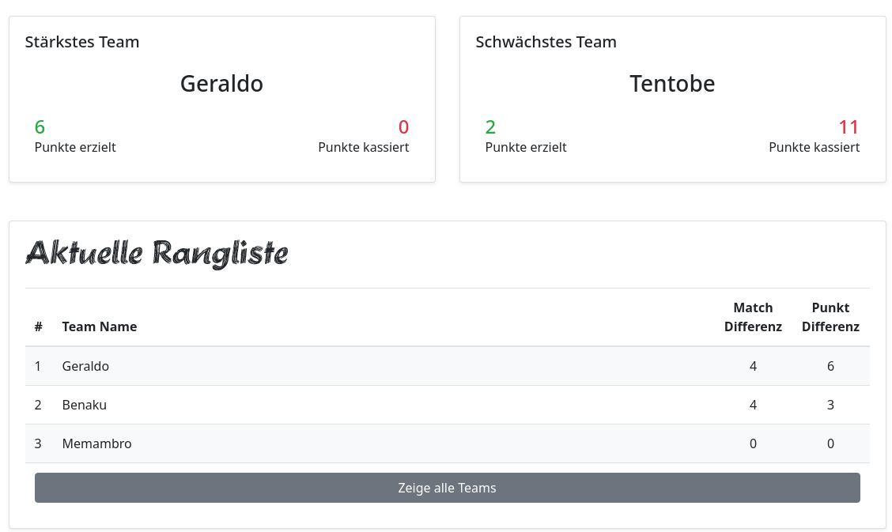

# turnie.re

Use Case Specification: StatisticsPage;  
Version v1.0

# Table of contents

%toc-content%

# %toc-caption-1% TournamentStatistics

## %toc-caption-2% Brief Description

This Use Case allows users to see statistics about a tournament.
The most Points scored or the closest games will be shown there for example.

# %toc-caption-1% Flow of Events

## %toc-caption-2% Basic Flow

 - User clicks on tournament page
 - User clicks on statistics 
 - User sees statistics
 
### %toc-caption-3% Activity Diagram

### %toc-caption-3% Feature
TBA

### %toc-caption-3% Mockup

## %toc-caption-2% Alternative Flows
Not Applicable (N/A)

# %toc-caption-1% Special Requirements
Not Applicable (N/A)

# %toc-caption-1% Preconditions
Tournament needs to be created

# %toc-caption-1% Postconditions
Not Applicable (N/A)

# %toc-caption-1% Extension Points
Not Applicable (N/A)
