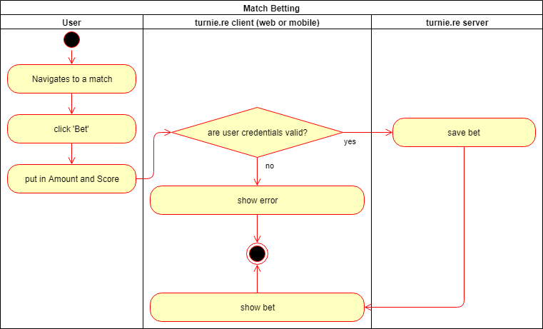

# turnie.re

Use Case Specification: MatchBetting;  
Version v1.0

# Table of contents

1. [Match Betting](#match-betting)
   1. [Brief Description](#brief-description)
1. [Flow of Events](#flow-of-events)
   1. [Basic Flow](#basic-flow)
      1. [Activity Diagram](#activity-diagram)
      1. [Feature](#feature)
      1. [Mockup](#mockup)
         1. [Betting](#betting)
   1. [Alternative Flows](#alternative-flows)
1. [Special Requirements](#special-requirements)
1. [Preconditions](#preconditions)
1. [Postconditions](#postconditions)
   1. [User enters Team that he bets on](#user-enters-team-that-he-bets-on)
1. [Extension Points](#extension-points)

# Match Betting

## Brief Description

This Use Case Allows Users to bet on who will win the match. When selecting a Match from the List of Matches, the user is asked who he thinks will win. We will then show the percentage each team is voted for.

# Flow of Events

## Basic Flow

 - user clicks on Match
 - user is asked who will win
 - user clicks on the team he thinks that will will
 - tournament view shows up again showing the percentages each team has
 
### Activity Diagram

### Feature
TBA

### Mockup
TBA

#### Betting
TBA

## Alternative Flows
Not Applicable (N/A)

# Special Requirements
Not Applicable (N/A)

# Preconditions
Not Applicable (N/A)

# Postconditions

## User enters Team that he bets on
Percentages for each team will be shown

# Extension Points
Not Applicable (N/A)

