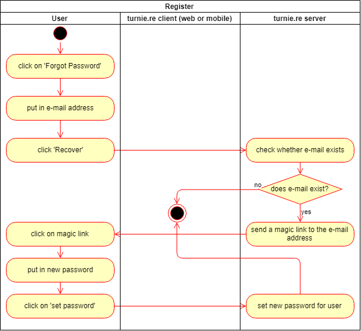
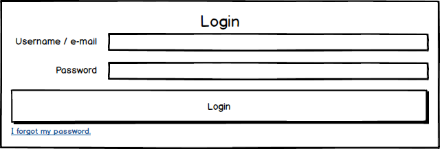
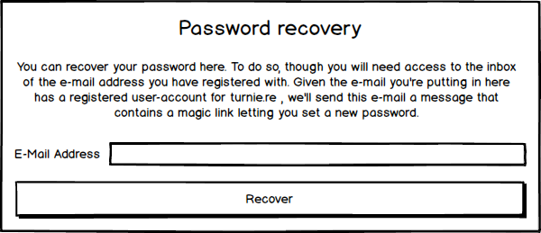

# turnie.re

Use Case Specification: Recover Password  
Version v1.0

# Table of contents

%toc-content%

# %toc-caption-1% Recover Password

## %toc-caption-2% Brief Description

This use case allows members, who have forgotten their password, to recover their account.
This is done by sending a message to the e-mail of the user who wants to recover their account, which contains a link with a personal token leading to a site that allows you to set a new password.

# %toc-caption-1% Flow of Events

## %toc-caption-2% Basic Flow

 - user clicks on 'forgot password' when trying to log in
 - user puts in his e-mail
 - user clicks on 'Recover' and gets shown a message that (in case the user with given e-mail exists) an e-mail has been sent to the given address
 - an e-mail is sent to the user's e-mail address
 - user clicks on the magic link in the e-mail
 - user puts in a new password
 - user clicks on 'recover'
 - server saves the new password
 
### %toc-caption-3% Activity Diagram

### %toc-caption-3% Feature
[features/recover_password.feature](../features/recover_password.feature)

### %toc-caption-3% Mockup

#### %toc-caption-4% Login

#### %toc-caption-4% Recover Password

## %toc-caption-2% Alternative Flows
Not Applicable (N/A)

# %toc-caption-1% Special Requirements

## %toc-caption-2% Javafxmail
Since this use case requires the server to send an e-mail to a given e-mail address, we'll need some kind of library that allows us to do so.
At the moment we're looking into using Javafxmail to solve this problem.

# %toc-caption-1% Preconditions
Not Applicable (N/A)

# %toc-caption-1% Postconditions

## %toc-caption-2% New password is set
The given password has been set for the user with the e-mail address that has requested the password recovery.

# %toc-caption-1% Extension Points
Not Applicable (N/A)
