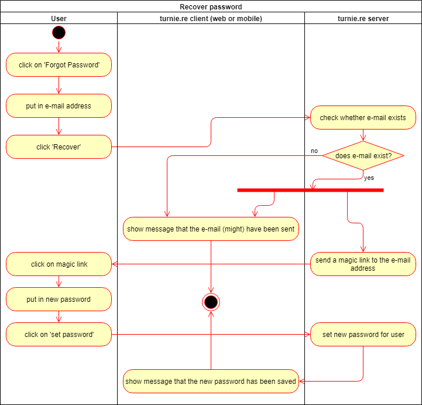
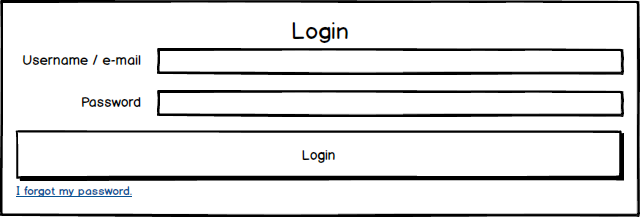

# turnie.re

Use Case Specification: Recover Password  
Version v1.0

# Table of contents

1. [Recover Password](#recover-password)
   1. [Brief Description](#brief-description)
1. [Flow of Events](#flow-of-events)
   1. [Basic Flow](#basic-flow)
      1. [Activity Diagram](#activity-diagram)
      1. [Feature](#feature)
      1. [Mockup](#mockup)
         1. [Login](#login)
         1. [Recover Password](#recover-password-1)
   1. [Alternative Flows](#alternative-flows)
1. [Special Requirements](#special-requirements)
   1. [Javafxmail](#javafxmail)
1. [Preconditions](#preconditions)
1. [Postconditions](#postconditions)
   1. [New password is set](#new-password-is-set)
1. [Extension Points](#extension-points)

# Recover Password

## Brief Description

This use case allows members, who have forgotten their password, to recover their account.
This is done by sending a message to the e-mail of the user who wants to recover their account, which contains a link with a personal token leading to a site that allows you to set a new password.

# Flow of Events

## Basic Flow

 - user clicks on 'forgot password' when trying to log in
 - user puts in his e-mail
 - user clicks on 'Recover' and gets shown a message that (in case the user with given e-mail exists) an e-mail has been sent to the given address
 - an e-mail is sent to the user's e-mail address
 - user clicks on the magic link in the e-mail
 - user puts in a new password
 - user clicks on 'recover'
 - server saves the new password
 
### Activity Diagram

### Feature
[features/recover_password.feature](../features/recover_password.feature)

### Mockup

#### Login

#### Recover Password

## Alternative Flows
Not Applicable (N/A)

# Special Requirements

## Javafxmail
Since this use case requires the server to send an e-mail to a given e-mail address, we'll need some kind of library that allows us to do so.
At the moment we're looking into using Javafxmail to solve this problem.

# Preconditions
Not Applicable (N/A)

# Postconditions

## New password is set
The given password has been set for the user with the e-mail address that has requested the password recovery.

# Extension Points
Not Applicable (N/A)
