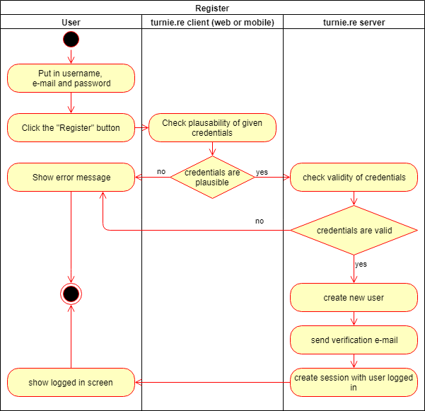
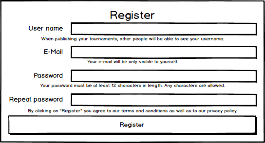

# turnie.re

Use Case Specification: UserCRUD  
Version v1.0

# Table of contents

1. [Register](#register)
   1. [Brief Description](#brief-description)
1. [Flow of Events](#flow-of-events)
   1. [Basic Flow](#basic-flow)
      1. [Activity Diagram](#activity-diagram)
      1. [Feature](#feature)
      1. [Mockup](#mockup)
   1. [Alternative Flows](#alternative-flows)
1. [Special Requirements](#special-requirements)
1. [Preconditions](#preconditions)
   1. [User is not logged in](#user-is-not-logged-in)
1. [Postconditions](#postconditions)
   1. [User will receive an verification e-mail](#user-will-receive-an-verification-email)
   1. [User will be able to perform member-actions](#user-will-be-able-to-perform-memberactions)
1. [Extension Points](#extension-points)

# Register

## Brief Description

This use case allows guests to register for our website, and afterwards use our services using the given e-mail, username and password.

# Flow of Events

## Basic Flow

 - user puts in his username, e-mail and password
 - user clicks on "Register" button
 - client checks plausibility of credentials (format of username / e-mail; equality of passwords)
 - if credentials aren't plausible we'll show an error
 - server checks validity of credentials (username doesn't exist; plausibility check)
 - if credentials aren't valid we'll show an error
 - show the user his logged in page
 
### Activity Diagram

### Feature
[features/register.feature](../features/register.feature)

### Mockup

## Alternative Flows
Not Applicable (N/A)

# Special Requirements
Not Applicable (N/A)

# Preconditions

## User is not logged in
The user may not have logged in prior to trying to sign up, since he then has already registered, which should be a one-time only thing to do.

Also the user will need an e-mail that has not yet been used to register for our service.

# Postconditions

## User will receive an verification e-mail
The user will receive an verification e-mail to the e-mail he has given.
This e-mail will contain a link, that will set the status of his profile to 'verified'.

## User will be able to perform member-actions
The user will (as long as he is logged in), be able to perform member-actions, like create tournaments.

# Extension Points
Not Applicable (N/A)
