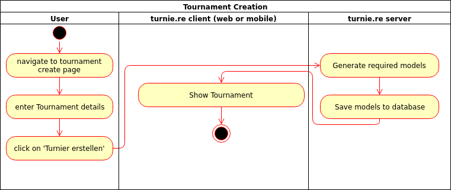
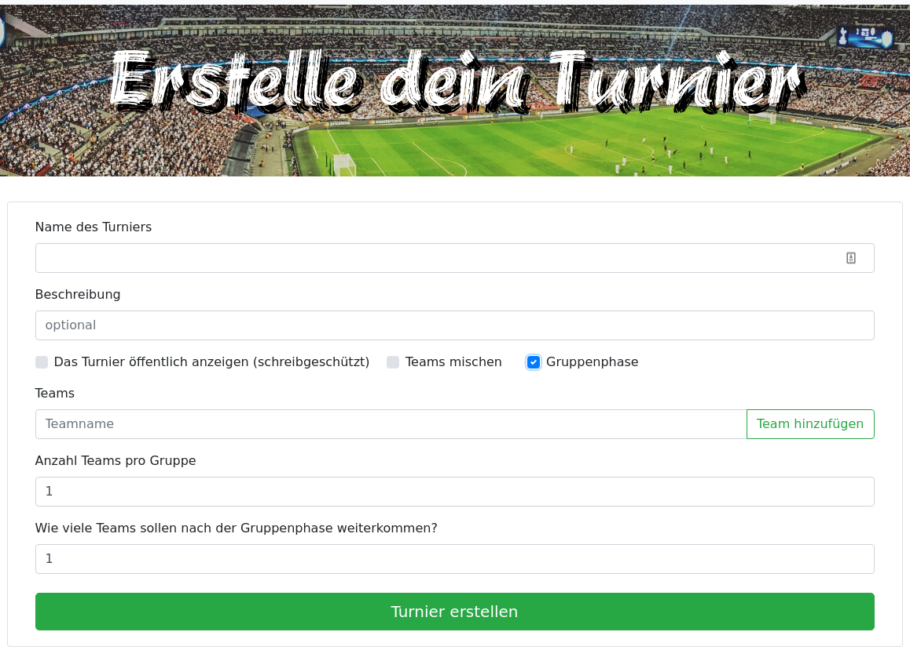

# turnie.re

Use Case Specification: TournamentCRUD  
Version v1.0

# Table of contents

1. [Register](#register)
   1. [Brief Description](#brief-description)
1. [Flow of Events](#flow-of-events)
   1. [Basic Flow](#basic-flow)
      1. [Activity Diagram](#activity-diagram)
      1. [Feature](#feature)
      1. [Mockup](#mockup)
   1. [Alternative Flows](#alternative-flows)
1. [Special Requirements](#special-requirements)
1. [Preconditions](#preconditions)
   1. [User is not logged in](#user-is-not-logged-in)
1. [Postconditions](#postconditions)
1. [Extension Points](#extension-points)

# Register

## Brief Description

This use case allows users to create update and delete a tournament.

# Flow of Events

## Basic Flow

 - user puts in necessary details for the tournament
 - user clicks on generate button
 - client checks plausibility of settings (format of team names / size of groups)
 - if settings aren't plausible we'll show an error
 - server checks plausibility of settings (format of team names / size of groups)
 - if settings aren't valid we'll show an error
 - show the user the generated tournament
 
### Activity Diagram

### Feature
TBA

### Mockup

## Alternative Flows
Not Applicable (N/A)

# Special Requirements
Not Applicable (N/A)

# Preconditions

## User is not logged in
The user will need to log in / register to create a tournament.

# Postconditions
User has a tournament and can update matches within.

# Extension Points
Not Applicable (N/A)
