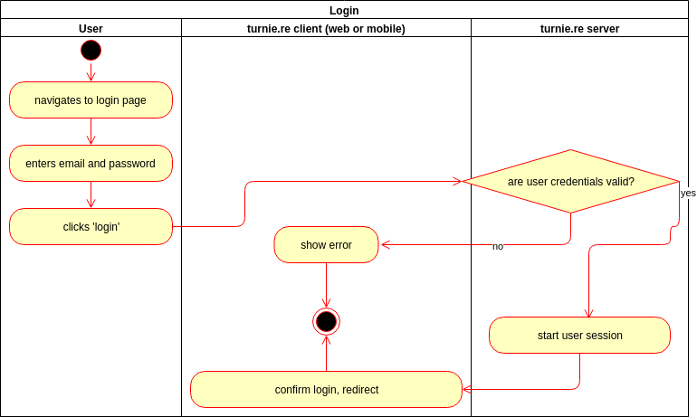
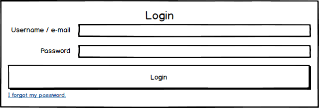

# turnie.re

Use Case Specification: Login  
Version v1.0

# Table of contents

1. [Login](#login)
   1. [Brief Description](#brief-description)
1. [Flow of Events](#flow-of-events)
   1. [Basic Flow](#basic-flow)
      1. [Activity Diagram](#activity-diagram)
      1. [Feature](#feature)
      1. [Mockup](#mockup)
   1. [Alternative Flows](#alternative-flows)
1. [Special Requirements](#special-requirements)
1. [Preconditions](#preconditions)
1. [Postconditions](#postconditions)
1. [Extension Points](#extension-points)

# Login

## Brief Description

Users can have accounts, which are used for authentication. This describes how a user authenticates if he already has an account.

# Flow of Events

## Basic Flow

 - user navigates on the login page
 - user puts in his e-mail
 - user puts in his password
 - user clicks on 'login'
 - the frontend sends the credentials to the backend
 - the backend validates the credentials and replies to the frontend
 - if the credentials are invalid, the frontend shows an error message
 - if the credentials are valid, the frontend
   - shows a success message
   - changes the menu bar to indicate that the user is now logged in
   - redirects the user to the landing page
  
 
### Activity Diagram

### Feature
todo

### Mockup

## Alternative Flows
Not Applicable (N/A)

# Special Requirements

# Preconditions
the user has registered and may log in

# Postconditions
the user is logged in, the frontend indicates that in the menu bar

# Extension Points
Not Applicable (N/A)
