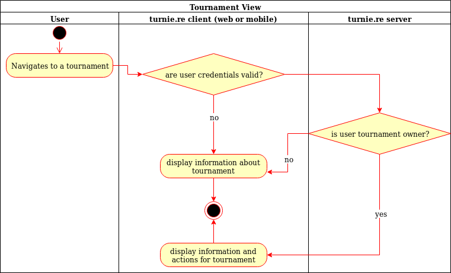

# turnie.re

Use Case Specification: TournamentsPage;
Version v1.0

# Table of contents

1. [Tournament](#tournament)
   1. [Brief Description](#brief-description)
1. [Flow of Events](#flow-of-events)
   1. [Basic Flow](#basic-flow)
      1. [Activity Diagram](#activity-diagram)
      1. [Feature](#feature)
      1. [Mockup](#mockup)
   1. [Alternative Flows](#alternative-flows)
1. [Special Requirements](#special-requirements)
1. [Preconditions](#preconditions)
1. [Postconditions](#postconditions)
1. [Extension Points](#extension-points)

# Tournament

## Brief Description

This use case allows users to see a tournament.
It includes the name, description, owner, group stage and playoff stage of a tournament.

# Flow of Events

## Basic Flow

 - User clicks on tournament page
 - User sees detailed information about a tournament
 
### Activity Diagram

### Feature
TBA

### Mockup

## Alternative Flows
Not Applicable (N/A)

# Special Requirements
Not Applicable (N/A)

# Preconditions
Tournament needs to be created

# Postconditions
Not Applicable (N/A)

# Extension Points
Not Applicable (N/A)
